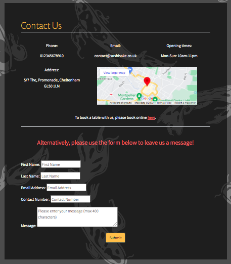

# Sushi & Sake | Japanese Kitchen

### Website for a fictional Japanese restaurant complete with booking system and account functionality

## Contents
- [About](#about)
- [User Experience](#user-experience)
    - [Target audiences](#target-audiences)
    - [User Stories](#user-stories)
    - [Sushi & Sake's Aims](#contact-book-aims)
    - [Iterations](#iterations)
    - [First Time Visitors](#first-time-visitors)
    - [Returning Visitors](#returning-visitors)
    - [User Journey](#user-journey)
    - [Colour Scheme and Fonts](#colour-scheme-and-fonts)
    - [Wireframes](#wireframes)
- [Features](#features)
- [Technologies Used](#technologies-used)
- [Testing](#testing)
- [Deployment](#deployment)
- [Credits](#credits)

## About

Sushi & Sake Japanese Kitchen is a website for a fictional Japanese restaurant. The code was written in Gitpod, with the repository stored in GitHub and hosted on Heroku with a PostGres database.

Potential customers can explore the website to find out more about the restaurant, create or login to their account, and book a table if required. Customers also have access to full CRUD functionality to manage their bookings or send a message to the restaurant.

The website also contains an admin panel where restaurant staff can view and manage all of the restaurants bookings in addition to any messages left for the restaurant.

A link to the live site can be found [here](https://sushi-and-sake.herokuapp.com/).

## User Experience

### Target Audiences

- Adults between the ages of 25-70 who enjoy fine dining
- For users that already love Japanese cuisine, and are looking to find out more about Sushi & Sake as a new Japanese Kitchen to try
- For users that have enjoyed the Sushi & Sake experience before
- For users looking for inspiration to find out more about and to try Japanese cuisine
- For users that wish to book a table and manage their bookings
- For users wanting to find or contact the restaurant

### User Stories

Before writing any of the actual code for the Sushi & Sake website, I took some time to evalaute what users would typically expect from a restaurant website. I used GitHub's Project's feature to create a User Stories board that I updated as I went along to keep track of the User Goals that I had decided upon.

1. As a user, I need to be able to navigate around the site
2. As a user, I need to be able to book a table for a specific time and amount of people
3. As a user, I need to be able to edit my booking
4. As a user, I need the option to delete my booking
5. As a user, I need to be able to create an account
6. As a user, I need to be able to log in to my account
7. As a user, I need to book tables that are actually available to avoid disappointment
8. As a user, I want to be able to see what experiences other people have had at Sushi & Sake restaurant
9. As a user, I want to be able to see pictures of the food to help me understand what to expect
10. As a user, I want to be able to view an up-to-date menu so that I can see what food I can expect at Sushi & Sake, with the relevant food items, prices and all-important dietary information
11. As a user, I want ways to communicate with the restaurant by contacting them directly through contact information or by leaving a message for the restaurant
12. As a user, I would like the option to sign up to a newsletter to keep up to date with the latest offers (future implementation)

### Sushi & Sake's Aims

- To create a website that echoes the vibrant atmosphere of the Sushi & Sake Japanese Kitchen and draw in new customers
- To create a website that showcases and promotes the exciting cuisine to encourage users to make bookings
- Provide guests with a way to book a table at the restaurant
- Provde the restaurant staff with the means to be able to view any bookings made
- Provide the restaurant staff with the means to be able to manage bookings
- Provide the restaurant staff with the means to be able to view any messages sent to the restaurant
- To have the use of a booking system that prevents double bookings to avoid poor experiences for customers
- The restaurant would like a way to easily manage and update their menus with the revelevant food items, prices and dietary information
- As a restaurant owner, I would like a space to promote offers and events to encourage people to come to the restaurant (future implementation)

### Iterations

To take an Agile approach to the project, I planned the stages that I would carry out the work. I categorised each User Story into 'must have', 'Could have' and 'Should have'. At this current stage in the Sushi & Sake website, I completed all user stories apart from the two 'could have' items, which I decided early on were outside the scope for this stage as I wanted to concentrate on successfully implementing the booking system, along with messages functionality.

#### Iteration 1
I prioritised the 'Must have' items and, thanks to Django's built-in admin panel and utilising all-auth, the functionality for the restaurant manage bookings and for users to create accounts meant that Iteration 1 managed to include a lot of the 'must have' items in a relatively short amount of time. 

 

Iteration 1

 

#### Iteration 2
With iteration 2, I shifted my focus from completing the work for the restaurant booking management to finishing the CRUD functionality for customer users. I built the pages for customers to view their bookings, then added the functionality for customers to edit and delete their bookings.

I also began to build customer-facing pages such as the Sushi & Sake home page and the functionality to allow customers to view the menu.

In hindsight, this iteration was by far the largest and I would have been better leaving some of this work (such as implementing the home page) to iteration 3 to make each the workload in each stage a bit more even.

Iteration 2

 

#### Iteration 3
Iteration 3 was implementing the last of the planned functionalitites, the ability for users to leave contact messages for the restaurant. This largely included builing the contact model and validating the contact form. At the suggestion of my mentor, I also added the admin dashboard for restaurant staff to easily see bookings and messages outside of the django admin panel.

Iteration 3

 

#### Iteration 4
After all of the initially planned user stories were implemented, I spent some time fine-tuning the project to best support a positive user experience for both the restaurant and its customers. This included things like ensuring all of the forms had the correct validations, increasing brand presence through the use of the Sushi & Sake logo and adding a helper box for the booking form.

Iteration 4

 

### First Time Visitors

- Visitors are greeted by an eyecatching landing page when they first visit the site, with clear brand prescence and 'Sushi & Sake Japanese Kitchen' message so that the purpose of the site is clear
- The landing page provides contains 'About us', 'Gallery' and a 'What our customers say' sections to give first time visitors a real feel for what Sushi & Sake is about and what they might expect from a dining experience at the restaurant
- The menu bar at the top gives a clear way for users to navigate between the pages of the site
- First time visitors can view the restaurant's menu so they can see what food is served and decide if they might like to eat there
- The page to book a table is clearly visible for those that decide they want to book a table
- If a user does not have an account, they are redirected to the page to sign up for an account
- The booking form is simple, with helper text and a guide to booking rules at the top of the page
- Flash messages provide feedback for confirming logins and bookings
- If new users wish to make an enquiry to the restaurant, there is a contact page that displays contact information and a clear contact form for the restaurant

### Returning Visitors

- Returning visitors can see the most up-to-date menu
- Returning visitors are most likely to utilise the booking system, as they will be the most likely to be visiting the site in order to book a table or manage their bookings
- The eyecatching design of the Suhsi & Sake website is pleasing to both new and returning visitors
- The contact form is clear for those returning visitors wishing to leave feedback about their experience

### User Journey

1. As a user, I arrive on the land page where a title immediately confirms that I am on the website for the Sushi & Sake Japanese Kitchen
2. As I scroll through the Sushi & Sake home page, there is a section where I can read about the restaurant, further down is a gallery that shows images of the delicious food and the restaurant, and finally some reviews from people that have been there
3. The navigation page at the top has a logo that I can recognise across the site
4. On the navigation bar I can see a large button encouraging me to book a table, along with options to view the menu, contact the restaurant, and to sign in or register for an account
5. I want to find out more about what food I can try before I decide to book a table, so I select the menu page where I am provided with a clearly separated and laid out menu with headings, prices, dietary information and descriptions so I know what the dishes are
6. Having found some dishes I would like I try, I decide to book a table so press on the large 'book now' button. The page tells me that I have to create an account to book a table and redirects me to a page where I can do so. After a quick sign-up process, I log in and  I can return to the page to book a table. Flash messages confirm when I have created an account and have signed in.
7. There is a help box at the top of the page followed by a labelled up form. If I input something wrong, the form comes up with an error message. When all the information is correct, I can press the 'book now' button and a message flashes at the top to confirm that my table has been booked, and the details.
8. The navigation bar now includes a 'My Bookings' tab, when I click on this I can see the booking I have made and that I have the option to edit or cancel my booking.

Whilst planning the functionality for the Sushi & Sake website, I had to consider how I was going to achieve both the aims for the user and the restaurant. This led to the creation of the features found in the Features section.

### Colour Scheme and Fonts

After doing some research and browsing the websites of other Japanese restaurants, I got an idea of the feel I wanted to create for Sushi & Sake's website. For an elegant look, I decided to combine a background of darks and greys against striking yellow and red. Red is a very popular colour in Japan, and the yellow connotes the luxury of gold tones.

For the fonts, I chose Alegreya Sans for the headings and Assistant for the body. I selected these from Google Fonts as they are both simple and easy-to-read fonts, whilst Alegreya is still striking in a bright colour against the dark background

### Wireframes

Before building my site in Gitpod, I took all of the features I thought to be in scope and combined these with my design ideas to create wireframes in Balsamiq. This helped me to implement a consistent design across the Sushi & Sake website to enhance a cohesive feel.

- [Index wireframe](wireframes/index-wireframe.png)
- [Make booking wireframe](wireframes/book-wireframe.png)
- [Contact wireframe](wireframes/contact-wireframe.png)
- [User Bookings wireframe](wireframes/user-bookings-wireframe.png)
- [Admin Dashboard](wireframes/admin-dashboard-wireframe.png)

## Features

### Logo
For the website to have a strong sense of brand, I created a logo for Sushi & Sake, incorporating a piece of sushi in one of the restaurant's theme colours. The logo is most prevalant in the navigation bar but is also incorporated into some of the other pages on the site for continuity.

Sushi & Sake logo

 

### Navigation bar
At the top of every page is the fixed navigation bar. It always contains links to the home page, menu, book and contact pages.
The other links in the navigation bar vary depending on what user is logged in to suit their needs and avoid frustration for pages they can't access.
If a user is not logged in, the last two links on the navbar are 'Register' and 'Log In'. If the person logged in is a customer, then the will have the option 'My Bookings' where they can update their bookings and the log out button. Lastly, if a member of staff at the restaurant is logged in, they will have the 'Admin Dashboard' available to them along with the log out button.

Admin navbar

Guest navbar

Navbar if user not logged in

 

### Footer
As the website has a busy navbar and background, I decided to keep the design for the footer simple so as not to make the user's screen too complicated. The footer contains links to Sushi & Sake's social media to encourage them to engage with the restaurant.

Footer

 

### Background
Whilst searching for a Japanese-themed background for the websit, I came across a koi carp background on [Pixabay](https://pixabay.com/). The dark grey of the background fits in well with the colour scheme of the website, and the koi carp on the pattern incorporates Japan's oriental style.

### About Us Section
After the hero image on the home page, the first thing that users scroll to is the 'About Us' section. This section is at the top of the page as it holds great importance, introducing new users to the restaurant and giving them a sense of what the restaurant is like.

About Us Section

 

### Gallery
Found on the home page, users can view a gallery containing images of the restaurant and the restaurant's food. This is a great feature for first-time users who are not sure what to expect from Sushi & Sake and showcases the elegant dining experience they can expect from the restaurant.

Gallery

 

### Reviews
Also found on the home page, there is a section where users can read reviews about the restaurant. This addition helps to promote the restaurant and give users trust in it when they can see the positive experiences other people have had.

Reviews

 

### Menu Page
Users can view the menu for Sushi & Sake on their website. Potential customers can read through the tantalising dishes available to see if Sushi & Sake is right for them, including their budgets and all-important dietary requirements. As this page is built using template tags based on the Food Item model objects, the restaurant can easily update the menu themselves from the Django backend administration panel. This benefits the restaurant as they do not have to pay to get the menu updated each time. It also pleases their customers who can see any new and exciting dishes as well as avoiding disappointment hoping for ones no longer on the menu! The menu is split into sections for easy readability and contains a key for allergen information.

Menu

 

### Contact Page
The contact page contains all important information for users of the Sushi & Sake site. It displays the restaurant's opening hours, telephone number, email, and address including a Google maps insertion. The Google map can be viewed in full screen to give the user directions to the restaurant.
At the bottom of the page, there is a contact form where users can leave a message for the restaurant. This message can be viewed by the restaurant in either the Django backend admininstration panel or, more easily, by the admin dashboard. The message form has fields for name, number, email and message so that the restaurant can see who has messaged them and so that they have the information to contact the customer back if necessary.

Contact

 

### Booking Page and Booking Form
The booking page contains two main elements- a help box at the top of the screen and the booking form itself. The help box outlines key information to help users input data such as opening times (the form will not submit if requested time is outside operating hours), and the maximum time they can book. This helps to streamline the booking process to lessen the chance of users getting frustrated and not continuing with the booking process.
The booking form itself contains clearly labelled fields with helper text so that users know what they should enter in each field. Users can pick their chosen table location, the number of guests the booking will be for, and their chosen booking start and end times. Each field has validation so that the form will not submit if the input data is not valid. If the booking is accepted, a flash message will confirm the reservation. If there is no available table for the booking time requested, the message will reflect this.
A successful booking will create a booking object that can be viewed by the guest in their 'my bookings' page, by the restaurant staff in the 'admin dashboard', or in the Django backend administration panel.

Book a Table

 

### Booking Management (Customer) and My Bookings Page
If a guest user is logged in, they can view a list of their bookings by clicking on the 'My Bookings' page. The page displays the information for each booking (time, date, number of guests) as well as the option to edit or delete each booking.
If they click the 'Edit booking' link, they are taken to a page that provides a booking form prepopulated with the previous booking details. This means that the user does not have to remember and re-input each form field, they only have to alter any fields they wish to change. Once they click the 'Update Booking' button, a flash message confirms that the booking has been updated.
If they click the 'Delete booking' link, they are taken to a page that asks them to confirm if they want to delete the selected booking. This screen once again brings up the details for the booking so they can check if they have selected the right one. If they select yes, then a flash message pops up to confirm the booking has been deleted. Selecting no takes them back to the bookings page.

My Bookings

 

### Availability Checker
As part of the booking system, I wrote a function that checks the availability of tables for a certain time. This is a key element of the booking system as it helps to avoid disappointing guests through double bookings. The check availability function evaluates which tables are big enough for the party size, checks existing bookings for their table numbers and returns the tables that are both big enough for the party sizes and are not already booked. The way that the system books the tables also returns the smallest available table for the amount of guests to avoid empty seats and loss of revenue (i.e. will avoid booking a party of 2 to a table with 8 seats if a 2 seater table is available). This allows the restaurant to fit in as many guests as possible and maximise their profit.

### Form validation
Both the contact and availability forms have validation for each field to ensure that the user cannot submit invalid data. If the user inputs invalid data, the website will raise a ValidationError and inform the user what they have done wrong. This helps users to fill out the forms more quickly and accurately and minimise user frustration.

### Accounts
I used all-auth to create an accounts system for Sushi & Sake. If users do not have an account, they can follow a simple sign-up process to create one with their chosen username and password. Once their account is created, they can use their username and password to log in to their own account, where they can then make and manage their bookings.
As the all-auth system includes different levels of user, the restaurant staff can sign in with their admin logins to access the admin dashboard. The authentication system means that users without an account cannot make or manage bookings.

Login

 

### Admin Dashboard
The admin dashboard can be accessed by restaurant staff to view a list of all bookings made to the restaurant and any messages left for them from the website.
The list of bookings for the restaurant shows the nearest booking times at the top, and restaurant staff can clear these off as guests arrive so they can easily see the next guests they are expecting. They also have the functionality to edit and delete bookings if necessary, following the same steps as if a guest user was to do so. Even if an admin amends a booking, the booking name remains the same.
The list of messages is at the bottom of the screen, displaying all of the information for the message. Although these cannot be edited, they can be deleted by the restaurant staff if they have been actioned. Pressing delete on a message from the admin dashboard takes the user to a screen to confirm deletion, and as with deleting bookings, displays the message details and content so that the user can check they are deleting the right message.
Users can use the links to quickly jump between each section.

Admin Dashboard

 

### Call to Action Buttons
To encourage users to book a table with the restaurant, large 'Book Table' call to action buttons are placed throughout the site. There is one in the navbar, several on the home page, one on the menu and a link on the contact page. As they are brightly coloured, they stand out and encourage users to click on them and book a table with the restaurant.

Call to Action Buttons

 

### Flash Messages
Flash messages have been implemented throughout Sushi & Sake's website to provide user feedback and confirmation of actions. They appear when a user logs in or out, makes a booking, updates a booking, deletes a booking, sends a message or deletes a message. This confirmation of actions helps to enhance the user experience by giving them confidence that certain actions have been completed.

Flash Message

 

## Technologies Used

Eyedropper Tool (Chrome Extension)

 
 - This tool allows me pick any colour from the web page I am and gives me the name (if applicable), hex, hsl and rgb values. I used this to make sure I was using the exact theme colours throughout the site

WebAIM

 
- Contrast Checker - checks the contrast of colours input against the Web Content Accessibility Guidelines. I input my background and foreground/text colours to ensure they meet the WCAG AA/AAA standards
- WAVE - WAVE can identify many accessibility and Web Content Accessibility Guideline (WCAG) errors

Balsamiq wireframing tool

 
- To create wireframes and plan out my project before beginning to write it in Gitpod

Canva

 
- I used the online logo maker to make the Sushi & Sake logo

Fontawesome

 
- The social media icons on the footer are taken from FontAwesome

Google Fonts

 
- Both my title and body fonts are imported from Google Fonts

W3C Markup Validation Service

 
- I used the HTML validator to run both my html pages and ensure there were no errors
- I used the Jigsaw CSS validator to ensure that my CSS file did not contain any errors

Lighthouse (Chrome DevTools)

 
- An open-source, automated tool for improving the quality of web pages. I used it to audit performance, accessibility, SEO and best practices

GitHub

 
-  To host my repository
- To create user stories
- To take an Agile approach by usign the project board to make iterations

GitPod

 
- An open-source developer platform used to write my code (using VS Code)

Visual Code Studio (VS Code)

 
- Visual Studio Code is a streamlined code editor with support for development operations like debugging, task running, and version control
- I used several VS Code extensions to help make my work more efficient such as:
    - Auto Close Tag (automatically adds HTML/XML closing tags)
    - Auto Open Preview Page (opens a preview panel when markdown or asciidoc file is opened)

Heroku

 
- To host my live site

Heroku PostGres database

 
- As a database to store my models and objects

Bootstrap

 
- Bootstrap CSS framework helped me to create a responsive and visually stunning site without having to spend too much time writing CSS

Django

 
- Django is a Python web framework that encourages rapid development. I used the Django framework, in particular the administration site to help manage my models and objects
- Django allauth is an integrated set of Django applications dealing with account authentication, registration, management that I used for my user accounts

Google Maps iFrame

 
- I used a Google Maps iFrame to insert a map onto my contact page to help users find the restaurant

 

## Testing 
Testing notes for the Sushi & Sake Japanese Kitchen project are contained in a separate [TESTING.md](TESTING.md) file.

## Deployment
The live site for Sushi & Sake is hosted on Heroku, a platform that enables developers to build, run, and operate applications entirely in the cloud. To deploy the live site on Heroku, I wrote my code in GitPod then pushed the code to GitHub. Heroku uses the code in the GitHub repository to build the live site.

To deploy the live site on Heroku:
1. Create a Heroku account and log in
2. Select to create a new app in Heroku. Give it a unique name and create new app
3. Once the new app is created, we need to set up a few things.
4. Under the 'Settings' tab, go to 'Add Buildpack button and click to add a buildpack. Select python. This helps Heroku understand it needs to build a Python app.
5. This project uses Heroku Postgres for the database, so next we need to add that. Go to the 'Resources' tab and search for Heroku Postgres in the Add-ons box.
6. Go back to the 'Settings' tab and click on 'Reveal Config-Vars'. Copy the 'DATABASE_URL' config var.
7. In GitPod, create an env.py file and create a new DATABASE_URL variable using the value copied from Heroku.
8. Back in Heroku, on the 'Settings' tab, add in the config-vars such as the SECRET_KEY
9. The settings.py file in Gitpod will need to be updated with the information for the new SECRET_KEY and DATABASE
10. Set up the html templates by adding a TEMPLATES_DIR variable with 'os.path.join(BASE_DIR, 'templates')'. Under TEMPLATES, update DIRS with the new variable
11. To make sure the app can be run on the local development server and in Heroku, we need to update the ALLOWED HOSTS key in the settings.py file, it should be updated to include 'localhost' and your Heroku app url (https://'YOUR APP NAME'.herokuapp.com/)
12. In the base directory on GitPod, create a Procfile and add 'web: gunicorn Your App Name.wsgi`'. This tells Heroku to create/run a web application.
13. In Heroku, click on the 'Deploy' tab. Select GitHub in the 'Deployment Method' section. You can search for your repository and select it to connect the repo to Heroku. Heroku gives the option to either deploy the latest GitHub code automatically with automatic deploys or to manually deploy a selected branch.

Full details for deploying to Heroku using Git can be found [here](https://devcenter.heroku.com/articles/git).

## Credits

### Form validation and inputs
- Form validation [mdn web docs](https://developer.mozilla.org/en-US/docs/Learn/Server-side/Django/Forms)
- Form validation, setting aware datetime/time objects - this [article by Adam Smith](https://www.adamsmith.haus/python/answers/how-to-set-the-timezone-of-a-datetime-in-python)
- Form validation, using date util by [Bloomberg](https://www.bloomberg.com/company/stories/work-dates-time-python/)
- Form validation, using date util [Programiz](https://www.programiz.com/python-programming/examples/string-to-datetime)
- Form validation, extracting time from datetime object [Geeks for Geeks](https://www.geeksforgeeks.org/extract-time-from-datetime-in-python/)
- Form validation, calculating the time difference between two datetime objects [GeekFlare](https://geekflare.com/calculate-time-difference-in-python/)
- Implementing widgets for form inputs [Django Project](https://docs.djangoproject.com/en/4.1/ref/forms/widgets/)

### Other
- Although I ended up greatly varying the booking logic from my inital code (see bugs in testing), I watched a couple of videos from [DarshanDev on YouTube](https://www.youtube.com/watch?v=-9dhCQ7FdD0&ab_channel=DarshanDev). His tutorials helped me to set up my booking model, my BookingView and the initial availability logic
- Updating URLS with ids [Open Classrooms](https://openclassrooms.com/en/courses/6967196-create-a-web-application-with-django/7349667-update-a-model-object-with-a-modelform)
- Managing users with different access levels [Real Python](https://realpython.com/manage-users-in-django-admin/)
- For setting up the project shell and database, I used the [Code Institute's](https://codeinstitute.net/) CodeStar Django Blog project
- Koi karp background used for theme throughout website found on [Pixabay](https://pixabay.com/vectors/koi-carp-pattern-japanese-3338735/)
- All of the images used on the site were found on [Pixabay](https://pixabay.com/) or [Unsplash](https://unsplash.com/) and then hosted on Cloudinary
- To help with Heroku deployment steps [Medium](https://medium.com/featurepreneur/how-to-connect-github-to-heroku-be6ff27419d3)

### General
- [Django documentation](https://docs.djangoproject.com/en/4.1/)
- [Python3 documentation](https://docs.python.org/3/)
- [W3 Schools](https://www.w3schools.com/python/)
- As always, [Stack Overflow](https://stackoverflow.com/questions/36432954/ was a great resource for troubleshooting

### Acknowledgements
- My mentor, Precious Ijege for his constructive feedback
- Gemma, Ed and Oisin at mentor support for helping me troubleshoot

### Inspiration
For the design on Sushi & Sake's website, I took inspiration from other Japanese restaurants. One of my favourite local restaurants, [Kibou](https://kibou.co.uk/) not only has delicious food but also a visually stunning website that helped me cultivate the elevated feel of the Sushi & Sake website. I also browsed the [Yo! Sushi website](https://yosushi.com/) for menu ideas.