# Testing

- [Validators](#validators)
- [Manual Testing](#manual-testing)
- [Automated Testing](#automated-tested)
- [Fixed bugs](#fixed-bugs)

## Validators
#### W3C Html Validator
I ran all of the html templates used through the W3C html validator.
Upon originally running the tests, there were a couple of unclosed divs and a few instances where there was an error from button elements being the child of an anchor tag. I fixed these errors prior to my final deployment and now no errors show.

Homepage HTML Validation

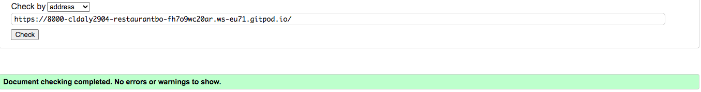

 

Login HTML Validation

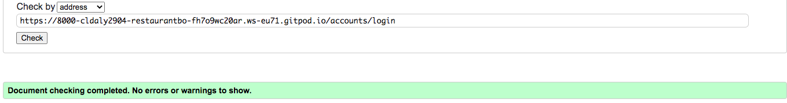

 

Menu HTML Validation

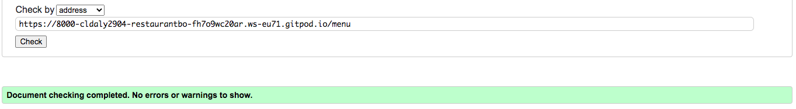

 

#### W3C CSS Jigsaw Validator
After running my style.css file through the CSS validator, there were no errors or warnings to show.

CSS Validator

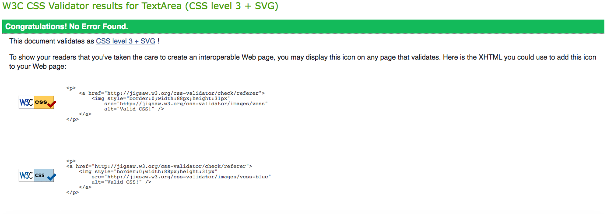

 

#### Pep8 Python Validator
I used GitPod's built in Pep8 Python Validator to check my Python code for errors. After going back and adjusting a lot of lines so that they didn't exceed the acceptable line length, the only supposed 'errors' showing were to do with Django models not having an objects member. Other than this, no actual errors were found.

As Gitpod shows errors in the problems window down by the terminal, I was able to eliminate syntax errors as I was writing my code.

Pep8 Python Validator

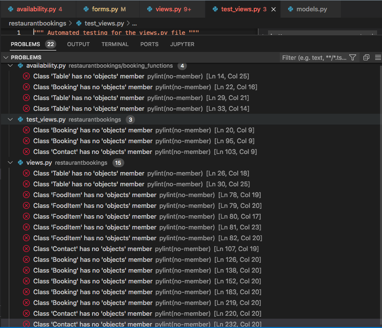

 

#### Lighthouse SEO
I ran different pages from Sushi & Sake's website through Chrome Dev Tool's Lighthouse validator, which gave high results in the 90s.

Homepage Lighthouse Validator

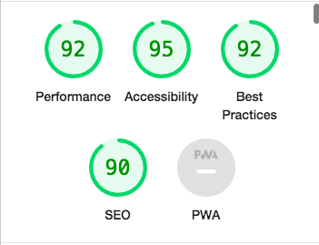

 

Contact Page Lighthouse Validator

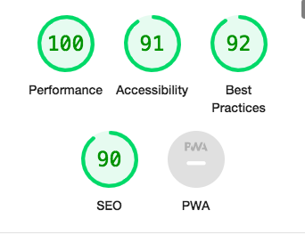

 

Menu Lighthouse Validator

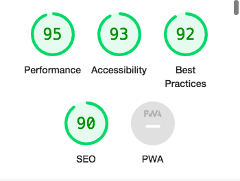

 

Booking Page Lighthouse Validator

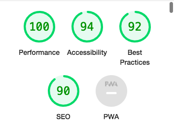

 

### JSHint Javascript Validator 
The Sushi & Sake website only uses a small amount of Javascript. The snippet was taken from the Code Institute's CodeStar blog for flash messages. It passed the JS validation with no error other than a couple of undefined variables (set outside the scope of the snippet).

JSHint

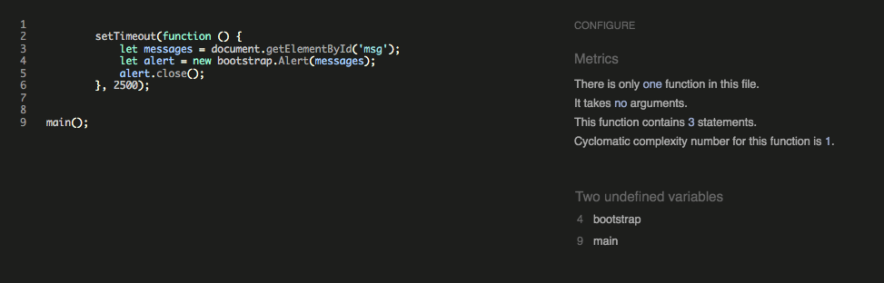

 

## Manual Testing
### Responsiveness

Whilst testing the site, I mainly used a combination of a live server extension (port 800 on Gitpod), and Chrome DevTools to create a responsive site that maintains a consistent design down to a width of 320px. I was able to achieve this with minimal media queries due to taking a 'mobile first' design approach and utilising Bootstrap's fluid containers and column/rows.

To test responsiveness to different screen sizes, I manually tested with Chrome Developer Tools and [Responsive Design Checker](https://responsivedesignchecker.com/).

I also opened the site on the different screen sizes of my iPhone and iPad. This gave me the opportunity to see if the proportions felt natural on these screen sizes and also to test the compatability with Safari, as most of the development was with Chrome.

Further to this, I sent the deplouyed site to potential users with different devices (such as Android) and browsers for testing. There were no reported issues regarding layout or browse limitations.

### Browser Compatibility

I tested Sushi & Sake Japanese Kitchen's site on the following browsers with no visible issues for the user:
 - Google Chrome
 - Safari
 - Mozilla Firefox
 - Microsoft Edge

Appearance, functionality and responsiveness were consistent for users on various different screen sizes and browsers.

### Links and Filepaths
I manually tested all the of the links throughout the website, both those on the navigation bar and those on the pages themselves. All links worked on the deployed site when tested and redirected the user to the requested page. I also checked the same-page links on the admin panel.
When deployed to the live site, I also checked that there were no broken image links. As all the images were hosted in Cloudinary, this helped eliminated broken links due to incorrect filepaths, and all urls were correct and rendering the right image.

### Form Validation
During testing it became apparent that both the availability booking and contact forms were lacking in validation. Although the input type in the forms.py file put some input restrictions in place, (for example users are unable to type anything other than numbers into the contact number box for the contact form) some of the fields were allowing invalid inputs such as fields just containing blank spaces.
A large proportion of iteration 3 was spent considering which forms needed what evaluation and implementing this. Some of the hardest validations to test and implement were for the booking start and booking end times. I implemented validation that meant that users could not enter a date in the past, functions to restrict users to booking slots no more than two hours long. I found working with datetime objects to do this particularly challenging as I had to make sure that I wasn't comparing offset and naive datetime objects.
If an input does not meet the validation requirements, or a required field is empty, the form will flag this up to the user and explain the error.

Form Validation Example 1

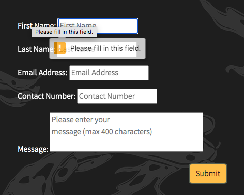

 

Form Validation Example 2

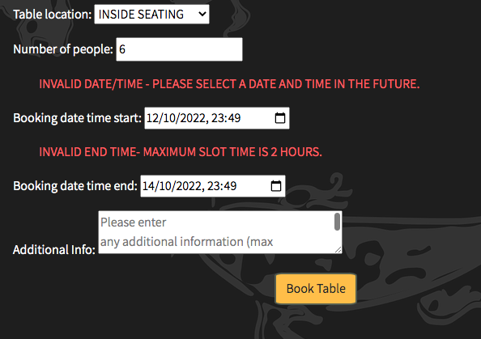

 

### Testing Feedback
- During the testing phase, after a meeting with my mentor I was given feedback that, for the restaurant staff, managing the restaurant bookings from the backend Django admin site wasn't very user friendly. This led to the creation of the admin panel on the main Sushi & Sake website. This became a very valuable addition to the site.

- I tested the site on family and friends and another piece of feedback recieved was to do with the booking form. The feedback was that it wasn't very user friendly for customers to have to remember and give their account username when they arrived at the restaurant to retrieve their reservation. After this feedback, I added the 'First Name' and 'Last Name' fields to the booking form that guests can simply give their name to the restaurant to retrieve their reservation.

## Automated Testing

## Fixed Bugs