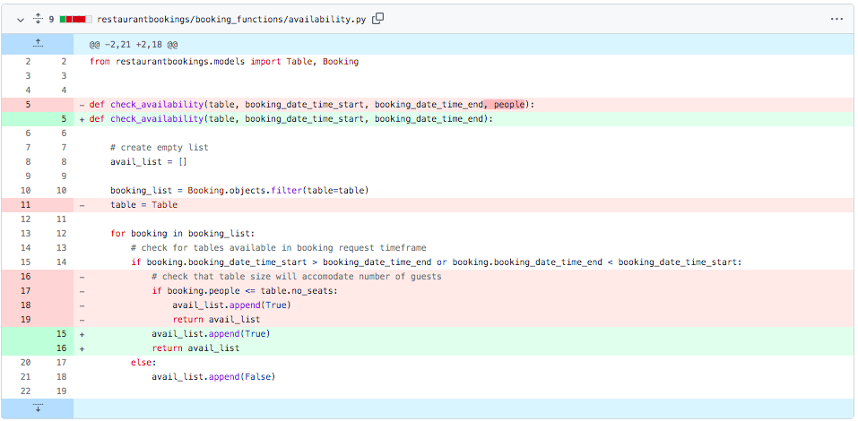
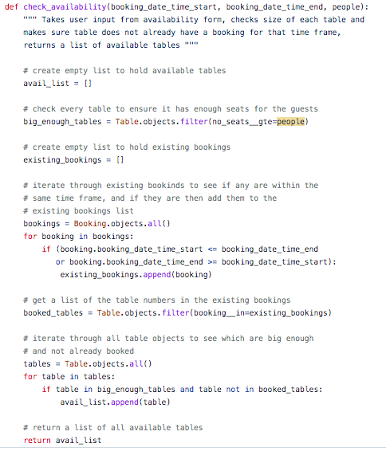

# Testing

- [Validators](#validators)
- [Manual Testing](#manual-testing)
- [Automated Testing](#automated-tested)
- [Fixed bugs](#fixed-bugs)

## Validators
#### W3C Html Validator
I ran all of the html templates used through the W3C html validator.
Upon originally running the tests, there were a couple of unclosed divs and a few instances where there was an error from button elements being the child of an anchor tag. I fixed these errors prior to my final deployment and now no errors show.

Homepage HTML Validation

 

Login HTML Validation

 

Menu HTML Validation

 

#### W3C CSS Jigsaw Validator
After running my style.css file through the CSS validator, there were no errors or warnings to show.

CSS Validator

 

#### Pep8 Python Validator
I used GitPod's built in Pep8 Python Validator to check my Python code for errors. After going back and adjusting a lot of lines so that they didn't exceed the acceptable line length, the only supposed 'errors' showing were to do with Django models not having an objects member. Other than this, no actual errors were found.

As Gitpod shows errors in the problems window down by the terminal, I was able to eliminate syntax errors as I was writing my code.

Pep8 Python Validator

 

#### Lighthouse SEO
I ran different pages from Sushi & Sake's website through Chrome Dev Tool's Lighthouse validator, which gave high results in the 90s.

Homepage Lighthouse Validator

 

Contact Page Lighthouse Validator

 

Menu Lighthouse Validator

 

Booking Page Lighthouse Validator

 

### JSHint Javascript Validator 
The Sushi & Sake website only uses a small amount of Javascript. The snippet was taken from the Code Institute's CodeStar blog for flash messages. It passed the JS validation with no error other than a couple of undefined variables (set outside the scope of the snippet).

JSHint

 

## Manual Testing
### Responsiveness

Whilst testing the site, I mainly used a combination of a live server extension (port 800 on Gitpod), and Chrome DevTools to create a responsive site that maintains a consistent design down to a width of 320px. I was able to achieve this with minimal media queries due to taking a 'mobile first' design approach and utilising Bootstrap's fluid containers and column/rows.

To test responsiveness to different screen sizes, I manually tested with Chrome Developer Tools and [Responsive Design Checker](https://responsivedesignchecker.com/).

I also opened the site on the different screen sizes of my iPhone and iPad. This gave me the opportunity to see if the proportions felt natural on these screen sizes and also to test the compatability with Safari, as most of the development was with Chrome.

Further to this, I sent the deplouyed site to potential users with different devices (such as Android) and browsers for testing. There were no reported issues regarding layout or browse limitations.

### Browser Compatibility

I tested Sushi & Sake Japanese Kitchen's site on the following browsers with no visible issues for the user:
 - Google Chrome
 - Safari
 - Mozilla Firefox
 - Microsoft Edge

Appearance, functionality and responsiveness were consistent for users on various different screen sizes and browsers.

### Links and Filepaths
I manually tested all the of the links throughout the website, both those on the navigation bar and those on the pages themselves. All links worked on the deployed site when tested and redirected the user to the requested page. I also checked the same-page links on the admin panel.
When deployed to the live site, I also checked that there were no broken image links. As all the images were hosted in Cloudinary, this helped eliminated broken links due to incorrect filepaths, and all urls were correct and rendering the right image.

### Form Validation
During testing it became apparent that both the availability booking and contact forms were lacking in validation. Although the input type in the forms.py file put some input restrictions in place, (for example users are unable to type anything other than numbers into the contact number box for the contact form) some of the fields were allowing invalid inputs such as fields just containing blank spaces.
A large proportion of iteration 3 was spent considering which forms needed what evaluation and implementing this. Some of the hardest validations to test and implement were for the booking start and booking end times. I implemented validation that meant that users could not enter a date in the past, functions to restrict users to booking slots no more than two hours long. I found working with datetime objects to do this particularly challenging as I had to make sure that I wasn't comparing offset and naive datetime objects.
If an input does not meet the validation requirements, or a required field is empty, the form will flag this up to the user and explain the error.

Form Validation Example 1

 

Form Validation Example 2

 

### Testing Feedback
- During the testing phase, after a meeting with my mentor I was given feedback that, for the restaurant staff, managing the restaurant bookings from the backend Django admin site wasn't very user friendly. This led to the creation of the admin panel on the main Sushi & Sake website. This became a very valuable addition to the site.

- I tested the site on family and friends and another piece of feedback recieved was to do with the booking form. The feedback was that it wasn't very user friendly for customers to have to remember and give their account username when they arrived at the restaurant to retrieve their reservation. After this feedback, I added the 'First Name' and 'Last Name' fields to the booking form that guests can simply give their name to the restaurant to retrieve their reservation.

## Automated Testing
As well as manual testing, I wrote a series of automated tests for my restaurantbookings/views.py file.

## Fixed Bugs
This project was definitely a large learning curve, but I enjoyed problem solving and building my Django project. Having the debug=True setting for building and testing meant that most of the little errors and bugs could be solved along the way, but a few were definitely head-scratchers!

Heroku deployment- 'No Module named dateutil' error

 

After setting up the inital shell for the project in GitPod, I deployed my live site on Heroku early to make sure it was all set up, and checked in with it after each large implementation to check the functionality. However, after making large changes to the restaurantbookings/forms.py file, I encountered an error where Heroku would not properly deploy the live site as it could not find 'dateutil'.

This was puzzling at first, as the project was working absolutely fine on the local server. I checked that dateutil was installed by entering 'pip3 install python-dateutil' in the terminal, but got the response that the conditions were already satisfied. I checked in my requirements.txt and could not see dateutil, so I typed the pip3 freeze command to updated requirements.txt. No changes.

After scouring the web, I found a Slack article (in credits) that told me to uninstall python-dateutil and install it. It seems that the pre-installed date-util was an old version, and as soon as I did the pip command to update requirements.txt and the dateutil requirement appeared, which could now be passed along to Heroku.

Incorrect URL files

 

Whilst trying to understand how to create a URL to contain a booking id, I discovered that I had made an error with my URLS files. I had pathed out all of the URLS in both the sushisake main urls.py file and the restaurantbookings urls.py file, which was throwing up error messages and unneccessary code.

I removed some urls from the main sushisake url file, as they were already covered by the 'include restaurantbookings' url line.

Templating bug for id url

 

Whilst creating the update part of the CRUD functionality for bookings, I needed to pass the booking id into the edit booking url. I kept getting the error that the booking id url was invalid and could not be found.

To troubleshoot, I reviewed the code for the Code Institute blog where the slug field was passed as a parameter for a url and the url link to it. My code matched so I decided that the error was not with the url setup. I went on to check the other factors affecting it, including the format of the href in the html template.

I went in to realise that it was a templating/context error. I was trying to use the booking.id but what I had passed through to the update html context was 'user-booking'. I had referred to the booking object as 'user-booking' on the html template instead of booking so they didn't match. I updated the context to pass in 'bookings' instead of 'user-bookings' and it was working as expected.

Changing the HTTP Response message to a flash message

 

The first draft of the booking functionality would redirect users to a HTTP Response page with either a booking success or booking failure message (depending on table availability). I wanted to change this so that users would instead recieve flash message feedback, and would be returned to a different html page within the Sushi & Sake site so that they could continue their experience.

However, when trying to alter this code to return a flash message, I got the response that the 'HTTP Response did not return an object, it returned None'. Although the previous code had worked fine, I couldn't figure out how to merge the working code and my desire for a flash message.

After a chat with Gemma from tutor support, she helped me to understand that the way I was trying implement the flash messages was more for function based views. She sent me a helpful article (in credits) which showed me how to add flash messages to class based views by adding in 'self.' before the request so that this argument could then be passed into the message.

Availability logic

 

Whilst testing the availability logic to avoid double booking in the availability.py file, I noticed that the booking system kept assigning unavailable tables to new bookings. It was returning the smallest possible table for the party size, regardless of whether the table already had bookings for that time frame.

The orginal code for the availability logic was based off a tutorial for a hotel system (in credits), but that code was for a hotel management system that was only checking the availability of a specific room rather than a list of objects like I was trying to do by checking all of the restaurant's tables. This led to a complete overhaul of the availability logic and the way the problem was approached.

Instead of checking every table all at once for the booking times, I took a more incremental approach. I started by creating a list of tables that were big enough for the party size. Then I found a list of all the existing bookings and made another list of those table numbers. Finally I made a list of available tables by adding any tables that were both big enough and were NOT in the list of already booked tables.

Original availability logic

Final availability logic

 